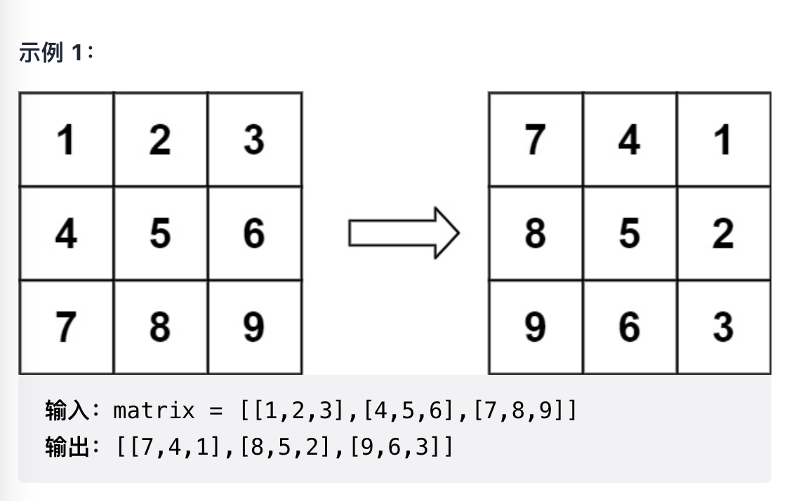
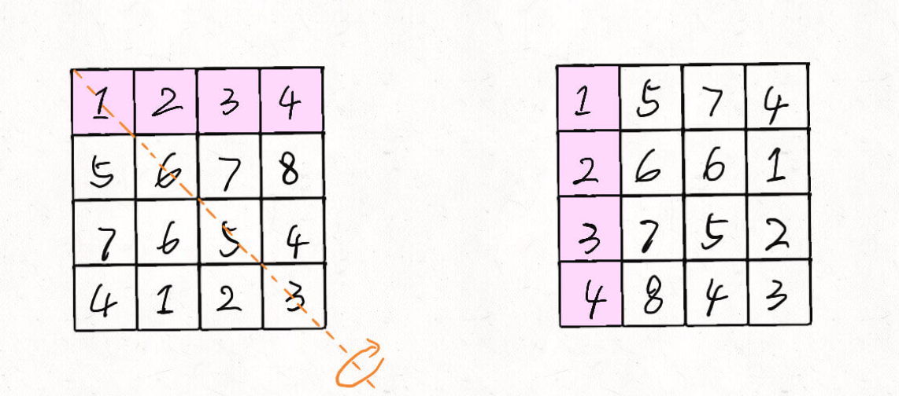
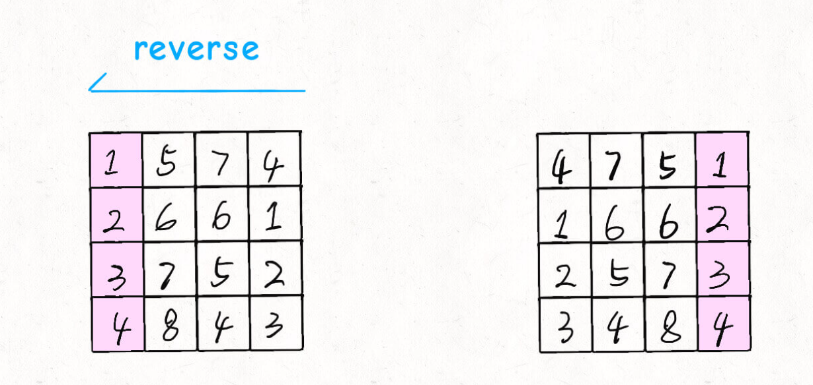
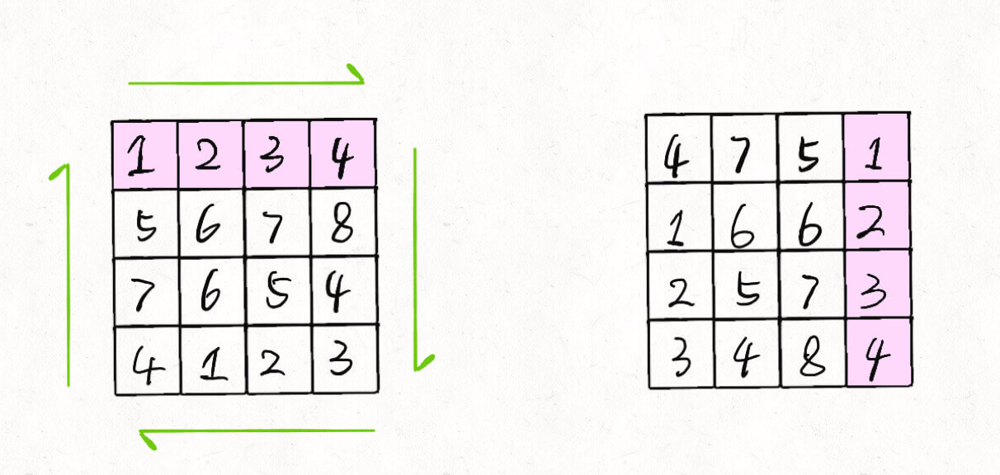
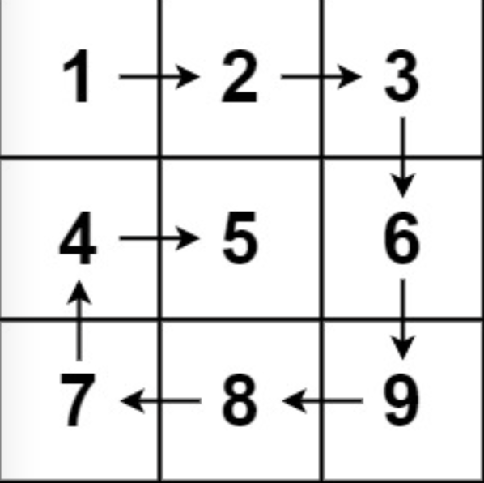
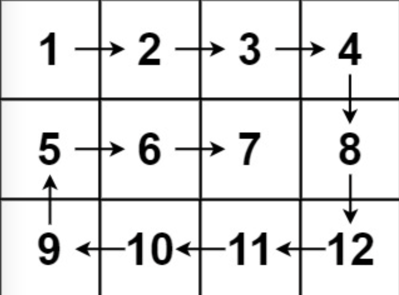
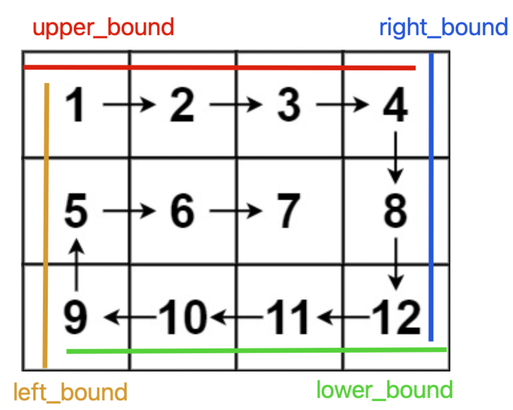
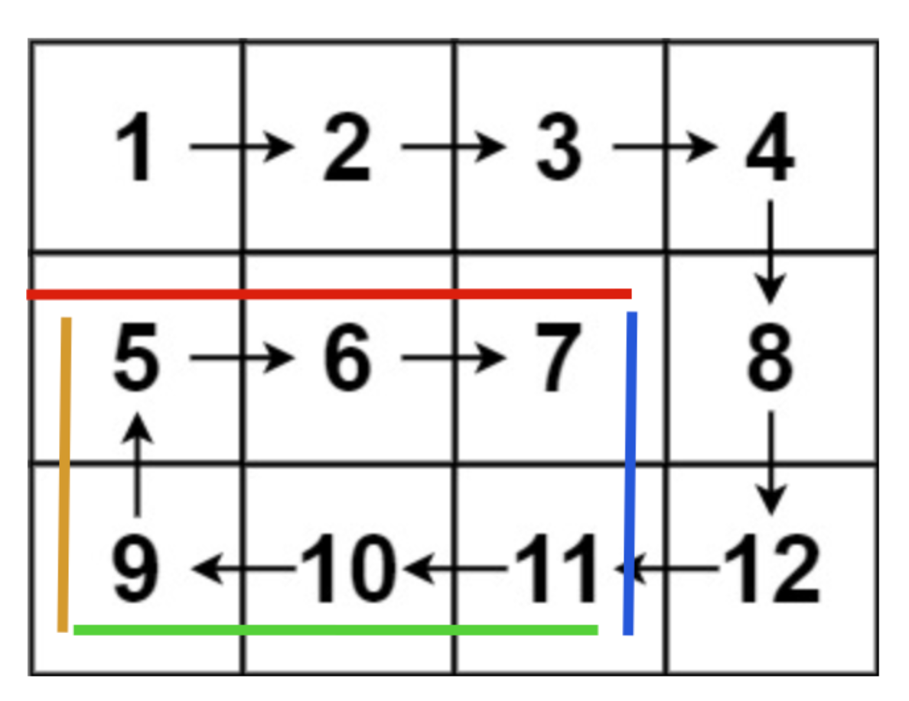
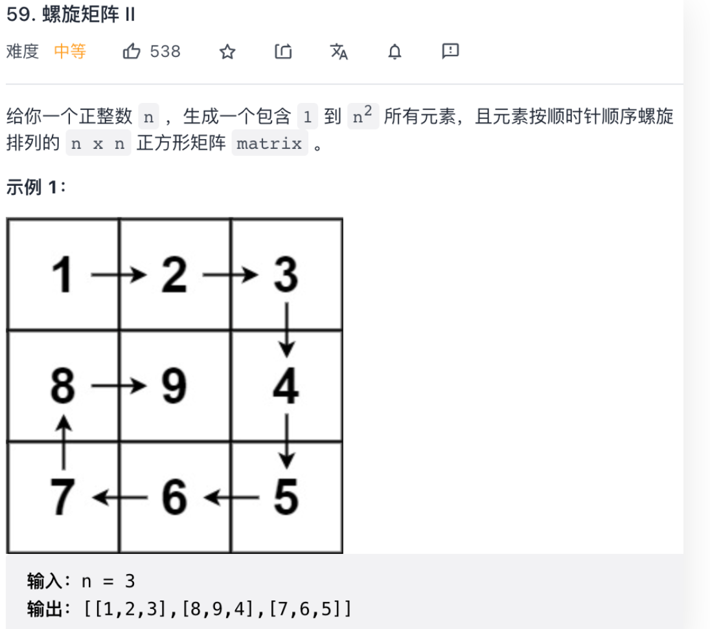

# 二维数组的花式遍历

> 给定一个包含若干单词的空格和字符串 s，设计一个算法，*原地* 反转所有单词的顺序 
let s = 'hello world eslyz'
 <br> 转换成 'eslyz world hello'
<br>
> 正确的做法是，先将整个字符串 s 反转：
> zylse dlrow olleh <br>
> 再将每个单词分别反转<br>
> eslyz world hello

---


## [旋转图像](https://leetcode-cn.com/problems/rotate-image)
>给定一个 n × n 的二维矩阵 matrix 表示一个图像。请你将图像顺时针旋转 90 度。
你必须在 原地 旋转图像，这意味着你需要直接修改输入的二维矩阵。请不要 使用另一个矩阵来旋转图像。



>先将 nxn矩阵 按照左上到右下的对角线进行镜像对称，
> 
>  
> 
> 然后再对举证的每一行进行反转
> 
> 
>
> 发现结果就是矩阵顺时针旋转90度的结果
> 
> 
> 
```javascript
function rotate(matrix) {
    let n = matrix.length
    // 先沿对角线镜像对称二维矩阵
    for (let i = 0; i < n; i++) {
        for (let j = i; j < n; j++) {
            let t = matrix[i][j]
            matrix[i][j] = matrix[j][i]
            matrix[j][i] = t
        }
    }
    // 然后反转二维矩阵的每一行
    for (let row of matrix) {
        reverse(row)
    }
}
// 反转一维数组
function reverse(arr) {
    let i = 0, j = arr.length - 1
    while(j > i) {
        let t = arr[i]
        arr[i] = arr[j]
        arr[j] = t
        i++
        j--
    }
}
// 将二维数组原地逆时针旋转90度
function rotate2(matrix) {
    let n = matrix.length
    // 沿左下到右上的对角线镜像对称二维矩阵
    for (let i = 0; i < n; i++) {
        for (let j = 0; j < n - i; j++) {
            let t = matrix[i][j]
            matrix[i][j] = matrix[n-j-1][n-i-1]
            matrix[n-j-1][n-i-1] = t
        }
    }
    for (let row of matrix) {
        reverse(row)
    }
}
```

## [螺旋矩阵](https://leetcode-cn.com/problems/spiral-matrix)
>给你一个 m 行 n 列的矩阵 matrix ，请按照 顺时针螺旋顺序 ，返回矩阵中的所有元素。<br>
> 例1. 输入：matrix = [[1,2,3],[4,5,6],[7,8,9]]<br>
>输出：[1,2,3,6,9,8,7,4,5] <br>
> 
>
> <br>
> 
> 例2.输入：matrix = [[1,2,3,4],[5,6,7,8],[9,10,11,12]]<br>
> 输出：[1,2,3,4,8,12,11,10,9,5,6,7]
> 
>
>

> 核心思路是按照 右、下、左、上的顺序遍历数组，并使用四个变量圈定未遍历元素的边界：
> 
> <br> 随着螺旋遍历，相应的边界会收缩，知道螺旋遍历完整个数组
> 
```javascript
function spiralOrder(matrix) {
    let m = matrix.length, n = matrix[0].length
    let upper_bound = 0, lower_bound = m - 1
    let left_bound = 0, right_bound = n - 1
    let res = []
    // res.length = m * n 时遍历完整个数组
    while (res.length < m * n) {
        if (upper_bound <= lower_bound) {
            // 在顶部从左向右遍历
            for (let i = left_bound; i <= right_bound; i++) {
                res.push(matrix[upper_bound][i])
            }
            // 上边界下移
            upper_bound++
        }
        if (left_bound <= right_bound) {
            // 在右侧从上向下遍历
            for (let i = upper_bound; i <= lower_bound; i++) {
                res.push(matrix[i][right_bound])
            }
            // 右边界左移
            right_bound--
        }
        if (upper_bound <= lower_bound) {
            // 在底部从右向左遍历
            for (let i = right_bound; i >= left_bound; i--) {
                res.push(matrix[lower_bound][i])
            }
            // 下边界上移
            lower_bound--
        }
        if (left_bound <= right_bound) {
            // 在左侧从下向上遍历
            for (let i = lower_bound; i >= upper_bound; i--) {
                res.push(matrix[i][left_bound])
            }
            // 左边界右移
            left_bound++
        }
    }
    return res
}
```

## [螺旋矩阵2](https://leetcode-cn.com/problems/spiral-matrix-ii/)

```javascript
function generateMatrix(n) {
    let matrix = []
    for (let i = 0; i < n; i++) {
        matrix[i] = []
        for (let j = 0; j < n; j++) {
            matrix[i][j] = 0
        }
    }
    let upper_bound = 0, lower_bound = n - 1
    let left_bound = 0, right_bound = n - 1
    let num = 1
    while(num<= n*n) {
        if (upper_bound <= lower_bound) {
            // 在顶部从左向右遍历
            for (let i = left_bound; i <= right_bound; i++) {
                matrix[upper_bound][i] = num++
            }
            // 上边界下移
            upper_bound++
        }
        if (left_bound <= right_bound) {
            // 在右侧从上往下遍历
            for (let i = upper_bound; i <= lower_bound; i++) {
                matrix[i][right_bound] = num++
            }
            // 右边界左移
            right_bound--
        }
        if (upper_bound <= right_bound) {
            // 在底部从右向左遍历
            for (let i = right_bound; i >= left_bound; i--) {
                matrix[lower_bound][i] = num++
            }
            lower_bound--
        }
        if (left_bound <= right_bound) {
            // 在左边从下往上遍历
            for (let i = lower_bound; i >= upper_bound; i--) {
                matrix[i][left_bound] = num++    
            }
            left_bound++
        }
    }
    return matrix
}
```