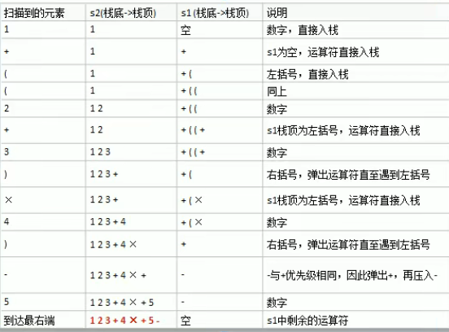

# 逆波兰计算器的实现

## 中缀表达式转后缀表达式

1. 初始化两个栈：运算符栈s1和存储中间结果的栈s2
2. 从左向右扫描中缀表达式
3. 遇到操作数时，压入s2
4. 遇到运算符时，比较其与s1栈顶运算符的优先级
   1. 如果s1为空，或栈顶运算符为左括号 "(" 则直接将此运算符 入栈
   2. 否则，若优先级比栈顶运算符的高，也将运算符压入 s1
   3. 否则，将s1栈顶的运算符弹出并压入 s2中，再次转到 (4.1)与s1中心的栈顶运算符比较
5. 遇到括号时：<br>
   1. 如果是左括号 "(",直接压入 s1
   2. 如果是右括号 ")",则依次弹出 s1 栈顶的运算符，并压入s2,直到遇到左括号为止，此时将这一对括号丢弃，
6. 重复 2-5,直到表达式的最右边
7. 将s1中剩余的运算符一次弹出并压入s2
8. 依次弹出s2中的元素并输出，结果的逆序即为中缀表达式对应的后缀表达式

中缀表达式 1 + ((2 + 3) * 4) - 5 ---> 转为后缀表达式 1 2 3 + 4 * + 5 -



```javascript
    class PolandNotation {
        constructor(midExpress) {
            if (!midExpress || !midExpress.length) throw new Error('mid express can not bt null')

            midExpress = midExpress.replaceAll(' ', '')
            // 定义逆波兰表达式
            // (3+4)x5-6
            // 为了方便，逆波兰表达式中的数字和符号使用空格分开
            // let suffixExpression = '30 4 + 5 * 6 -'
            // 4 * 5 - 8 + 60 + 8 / 2
            // let suffixExpression = '4 5 * 8 - 60 + 8 2 / +'
            // 1. 先将 suffixExpression 放入list中
            // this.list = suffixExpression.split(' ')
            // this.midExpress = midExpress
            this.list = this.toInfixExpressionList(midExpress)
            console.log('中缀表达式 = ', this.list)
            this.list = this.transform()
            console.log('后缀表达式 = ', this.list)
        }
        // 中缀表达式 转为 后缀表达式
        transform() {
            let stack1 = []
            // s2这个栈没有pop操作，后面还需要逆序操作，且当成数组处理
            let stack2 = []
            let index = 0
            while (index < this.list.length) {
                let str = this.list[index]
                if (str.match("\\d+")) {
                    stack2.push(str)
                } else if (str === '(') {
                    stack1.push(str)
                } else if (str === ')') {
                    // 如果是右括号 ")",则依次弹出 s1 栈顶的运算符，
                    // 压入s2,直到遇到左括号为止
                    while (stack1[stack1.length-1] !== '(') {
                        stack2.push(stack1.pop())
                    }
                    stack1.pop()// 将 ( 弹出 s1  此时将这一对括号丢弃，
                } else {
                    // 当 str的优先级小于或等于栈顶运算符的优先级
                    // 将s1栈顶的运算符弹出并压入 s2中，再次转到 (4.1)与s1中心的栈顶运算符比较
                    while (stack1.length > 0 && this.priority(stack1[stack1.length-1]) > this.priority(str)) {
                        stack2.push(stack1.pop())
                    }
                    stack1.push(str)
                }
                index++
            }
            while (stack1.length > 0) {
                stack2.push(stack1.pop())
            }
            // stack2 就是后缀表达式
            return stack2
        }
        isOperator(operator) {
            return ['+', '-', '*', '/'].includes(operator)
        }
        priority(operator) {
            if (operator === '*' || operator === '/') {
                return 2
            } else if (operator === '+' || operator === '-') {
                return 1
            } else {
                return -1
            }
        }

        // 将中缀表达式中的每个字符存入 list中
        toInfixExpressionList(s) {
            let ls = []
            let i = 0
            let str = ''// 对多位数的拼接
            let c // 遍历到的每个字符串
            do {
                // c 不是数字，直接加入ls中
                c = s[i]
                if (c.charCodeAt(0) < 48 || c.charCodeAt(0) > 57) {
                    ls.push('' + c)
                    i++
                } else {
                    // 是数字，需要考虑多位数的问题
                    str = ''// 清空之前保存的值
                    while (i < s.length && c.charCodeAt(0) >= 48 && c.charCodeAt(0) <= 57) {
                        str += c
                        i++
                        c = s[i]
                    }
                    ls.push(str)
                }
            } while (i < s.length)
            return ls
        }


        /**
         * 1.从左向右扫描，将3和4压入栈
         * 2.遇到+运算符，因此弹出4和3， 计算出 3+4的值，再将结果7压入栈
         * 3.将5压入栈
         * 4.遇到x 运算符，计算 7x5的值，将35入栈
         * 5.将6压入
         * 6.最后是-运算符，计算 35-6 =29 即为最终结果
         */
        calculate() {
            let stack = []
            for (let i = 0; i < this.list.length; i++) {
                let item = this.list[i]
                // 正则判断是否为数字
                if (item.match("\\d+")) { // 匹配的是多位数
                    stack.push(item)
                } else {
                    // pop出两个数字，并运算
                    let num2 = parseInt(stack.pop())
                    let num1 = parseInt(stack.pop())
                    let res = 0
                    if (item === '+') {
                        res = num1 + num2
                    } else if (item === '-') {
                        res = num1 - num2
                    } else if (item === '*') {
                        res = num1 * num2
                    } else if (item === '/') {
                        res = num1 / num2
                    } else {
                        throw new Error('不支持的运算符' + item)
                    }
                    stack.push(res + '')
                }
            }
            // 最后stack中的数据就是运算结果
            return stack.pop()
        }
    }
    let expression = '1+((2+3)*4)-5'
    let n = new PolandNotation(expression)
    console.log(n.calculate())
```