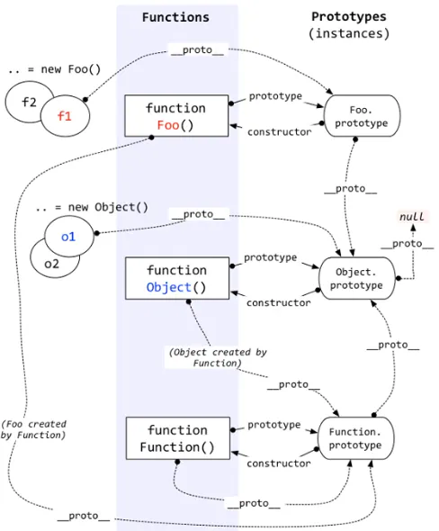

# js 高级 
[看下这篇文章](https://jsgodroad.com/interview/js/)

## js 重载
```javascript
function addMethod(object, name, fn) {
   let old = object[name]
   object[name] = function () {
        if (fn.length === arguments.length) {
            return fn.apply(this,arguments)
        } else if (typeof old === "function") {
            return old.apply(this, arguments)
        }
   }
}
addMethod(window, 'fn', (name) => {console.log(`我是${name}`)})
addMethod(window, 'fn', (name, age) => {console.log(`我是${name}，今年${age}`)})
addMethod(window, 'fn', (name, age, sport) => console.log(`我是${name},今年${age}岁,喜欢运动是${sport}`))
window.fn('李青')
window.fn('李青', 999)
window.fn('李青', 999, '神龙摆尾')
```

## var this
1. var 存在声明提升，即在定义变量前就能访问，值是undefined
2. var 存在变量覆盖，即可以定义相同名称的var变量，后面的会覆盖前面的
3. var 没有块级作用域-> for循环中使用var 定义变量，for循环结束后，还可以访问

## 原型、原型链

1. 所有对象都有一个属性__proto__指向一个对象，也就是原型  prototype对象
2. 每个对象的原型都可以通过constructor找到构造函数，构造函数也可以通过prototype找到原型
3. 所有函数都可以通过__proto__找到Function对象
4. 所有对象都可以通过__proto__找到Object对象
5. 对象之间通过__proto__连接起来，这样称之为原型链。当前对象上不存在的属性可以通过原型链一层层往上查找，知道顶层的Object对象，再往上就是null了

## [继承](https://juejin.cn/post/6844903696111763470)
ES6中的class 本质上就是一个函数。
1. ES6继承的子类需要调用super()才能拿到子类，ES5是通过apply这种绑定的方式
2. 类声明不会提升，和let这些一直

```javascript
function Super(name){
}
Super.prototype.getNum = function () {return 1}
function Sub(name, age){
}
Sub.prototype = Object.create(Super.prototype, {
    constructor: {
        value: Sub,
        enumerable: false,
        writable: true,
        configurable: true
    }
})
```

## 深拷贝
```javascript
function deepClone(obj, map = new WeakMap()) {
   if (typeof obj === 'object' && obj !== null) {
       const cache = map.get(obj)
       if (cache) return cache
       const isArr = Array.isArray(obj)
       let result = isArr ? [] : {}
       map.set(obj, result)
       if (isArr) {
           obj.forEach((item, index) => {
               result[index] = deepClone(obj[item])
           })
       } else {
           Object.keys(obj).forEach(key => {
               result[key] = deepClone(obj[key])
           })
       }
       return result
   }
   return obj
}
```

## promise
1. 链式调用中，只有前一个then 的回调执行完毕后，跟着的then中的回调才会被加入至微任务队列
2. 每个链式调用的开端会首先依次进入微任务队列
3. 同一个promise的每个链式调用的开端会首先依次进入微任务队列
4. 当Promise.resolve的时候会产生一个微任务 (Promise.resolve 会返回一个成功状态的promise，因为修改了promise的状态，所以会加入微任务队列)

## new 关键字做了什么事
1. 创建一个新的对象
2. 对象连接到构造函数原型上，并绑定this
3. 执行构造函数代码
4. 返回新对象
```javascript
/**
 * 创建Fn的实例对象
 * @param Fn
 */
function createIns(Fn, ...args){
    let obj = {}
    const result = Fn.call(obj, ...args)
    obj.__proto__ = Fn.prototype
    // 当构造函数返回一个对象时，这个方法内部的obj会被覆盖，所以一般来说，构造函数不会返回对象，返回原始类型影响
    return result instanceof Object ? result : obj
}

```

## 模块化
> commonjs、AMD、CMD、ES6
> <br> commonjs 通过 module.exports 暴露模块，通过require('')引入模块
> <br> AMD 通过define(['dependency'], 有返回值的callback) 定义模块， require(['myModule'], function cb(my){}) 加载模块，依赖requirejs
> <br> ES6 为主流
```javascript

export {} 对应 import { xx, xx } from 'xx'   分别暴露需要解构赋值的形式引入
export default {} import xxx from 'xxx'     默认暴露引入后直接使用
export const num = 123   
```

## CommonJS和ESM的区别
1. 前者支持动态导入，也就是require(${path}/xx.js)，后者使用import()
2. 前者是同步导入，因为用于服务端，文件都在本地，同步导入即使卡主主线程影响也不大。而后者是异步导入，因为用于浏览器，需要下载文件，如果也采用同步导入对渲染有很大影响
3. 前者在导出时都是值拷贝，就算导出的值变了，导入的值也不会改变，所以如果需要更新值，必须重新导入一次。但是后者采用实时绑定的方式，导入导出的值都指向同一个内存地址，所以导入值会随导出值变化。
4. CommonJS输出的是值的拷贝，ES6模块输出的是值的引用
5. CommonJS是运行时加载，ES6模块时编译时输出接口。

## async函数实现原理
> async函数是基于generator实现，所以涉及到generator相关知识。在没有async函数之前，通常使用co库来执行generator，所以通过co模拟async的实现
```javascript
function Asyncfn() {
    return co(function*(){
        // ...
    })
}
function co(gen) {
    return new Promise((resolve, reject) => {
        const fn = gen()
        function next(data) {
            let {value, done} = fn.next(data)
            if (done) return resolve(value)
            Promise.resolve(value).then(res => {
                next(res)
            }, reject)
        }
        next()
    })
}
```

## 性能优化之 dns-prefetch、prefetch、preload、defer、async
### dns-prefetch
> 域名转换为ip是一个比较耗时的过程，dns-prefetch能让浏览器空闲的时候帮你做这件事。
> 尤其是大型网站会使用多域名，这时候更加需要dns预取
```javascript
<link rel="dns-prefetch" href="//m.baidu.com">
```
### prefetch
>prefetch一般用来预加载可能使用的资源，一般是对用户行为的一种判断，浏览器或在空闲的时候加载prefetch资源
```javascript
<link rel="prefetch" href="http://www.example.com">
```
### preload
>和prefetch不同，prefetch通常是加载接下来可能用到的页面资源，而preload是加载当前页面要用的脚本、样式、字体、图片等资源。
> 所以preload不是空闲时加载，它的优先级更强，并且会占用http请求数量。
```html
<link rel="preload" href="style.css" as="style" onload="console.log('style loaded')">
```
as的值包括
1. "script"
2. "style"
3. "image"
4. "media"
5. "document"

### defer 和 async
```html
<script defer src="script.js"></script>
<script async src="script.js"></script>
```
> defer和async都是异步(并行)加载资源，不同点是async是加载完立即执行，而defer是加载完不执行，
> 等到所有元素解析完在执行，也就是DOMContentLoaded事件触发之前
> <br>因为async加载的资源师加载完执行，所以它并不能保证顺序，而defer会按照顺序执行脚本


## [浏览器的渲染流程](https://www.processon.com/view/5a68611fe4b010a6e72f0d6f)
***
### 浏览器的主进程：Browser进程
1. 负责下载资源
2. 创建销毁render进程
3. 负责将render进程生成的位图渲染到页面上
4. 与用户交互

### 浏览器内核：render进程
1. js引擎线程：由一个主线程和多个web worker线程组成，web worker线程不能操作dom。
2. GUI线程：用于解析html生成DOM树，解析css生成CSSOM，布局layout、绘制paint。回流和重绘依赖该线程。
3. 事件线程：当事件触发时，该线程将事件的回调函数放入callback queue（任务队列）中，等待js引擎线程处理。
4. 定时触发线程：setTimeout和setInterval由该线程来计时，计时结束，将回调函数放入任务队列
5. http请求线程：每有一个http请求就开一个该线程，每当检测到状态变更就会产生一个状态变更事件，如果这个事件有对应的回调函数，将这个函数放入任务队列。
6. 任务队列轮询线程：用于轮询监听任务队列。

### 流程
1. 获取html文件
2. 从上到下解析html
3. 并行请求资源
   1. css资源不会阻塞html解析，但是会阻塞页面渲染，所以一般放在头部，因为没有css，页面看起来很丑
   2. js资源会阻塞html解析，所以放在后面
4. 生成DOM Tree和style rules
5. 构建render tree
6. 执行布局过程(layout，也叫回流)，确定元素在屏幕上的具体坐标
7. 绘制到屏幕上(paint)

## 事件
1. DOMContentLoaded：当初始的HTML文档被完全加载和解析完成(script脚本执行完，所属的script脚本之前的样式表加载解析完成)之后，这个事件被触发。
2. onload：所有资源加载完成触发window的onload事件。

## js引擎
Chrome使用的v8
webkit使用的 JavaScriptCore
Mozilla的SpiderMonkey
QuickJS
facebook在react native 中使用的Hermes

以Chrome的v8为例。是一个接受JavaScript代码，编译代码然后执行的c++程序，编译后的代码可以在多种处理器上运行

主要有三大块  解析器(parser)、解释器(interpreter)、编译器(compiler)

1. 解析器将代码解析成AST
2. 解释器将AST编译成字节码(bytecode)，解释器也有直接解释执行字节码的能力
3. 编译器将字节码编译成机器码

v8在5.9之前会直接将AST生成机器码
由 Full-codegen(也叫基准编译器)编译器直接使用AST编译出机器码，
当代码运行一段时间后，v8引擎中的分析器线程收集到了足够多的数据，来帮助另一个编译器
Crankshaft(也叫优化编译器)来做代码优化，然后需要优化的源码重新解析生成AST，然后Crankshaft使用新的AST生成优化后的机器代码，来提升运行的效率

这种形式没有字节码的生成，速度相对来说更快，但是有几个问题
1. 机器码占用大量内存
2. 缺少中间层字节码，无法实现一些优化策略
3. 无法很好的支持和优化JS的新语法特性

5.9之后的版本

语法树的解析与上面保持一直，在拿到AST之后，
加入了Ignition解释器，通过Ignition生成字节码，此时AST就被清除掉了，释放内存空间。
生成的字节码直接被解释器执行，同时生成的字节码将作为基准执行模型。
执行的过程中 收集到了很多的信息，比如变量类型，调用次数多的函数等。
新的优化编译器TurboFan将根据收集到的信息编译出经过优化的机器代码。

在某些情况下，优化后的机器代码可能会被还原成字节码，这个过程叫做deoptimization
因为JS是动态语言，会导致Ignition收集到的信息是错误的。例如，函数多次调用后，参数类型发生变化，
优化后的机器代码就不对了，，--->所以尽量不要把参数的类型随便更改


相对于旧版的优势：
1. 字节码占用的空间更小，编译成字节码的速度更快，网页可以更快的onload
2. 生成优化机器代码时，不用重新编译生成AST，直接使用字节码就行
3. 需要deoptimization时，只需要回退到字节码就行。

4. 如果函数只是被声明未被调用，则该函数不会被解析成AST，也就不会生成字节码
5. 函数只会被调用一次，Ignition生成字节码会直接被解释执行，TurboFan不会优化编译
6. 函数被调用多次，可能会被表姐为热点函数，可能会被编译成机器代码

 


