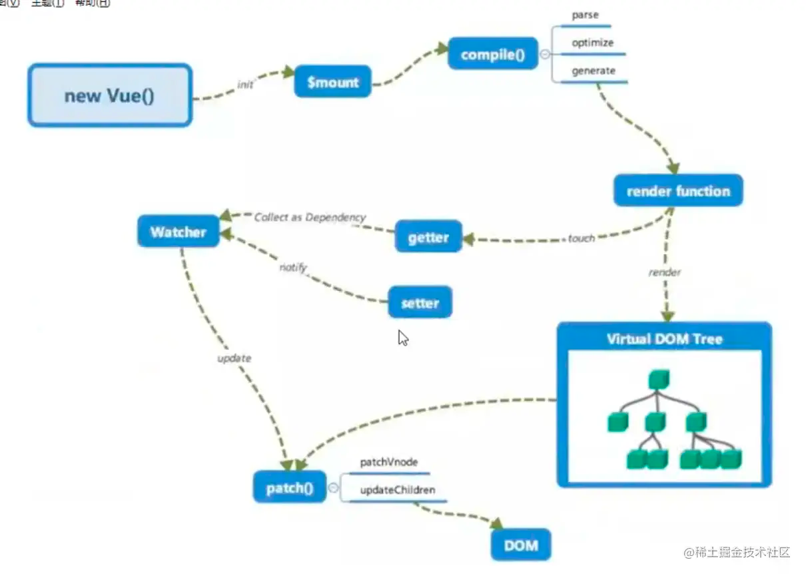
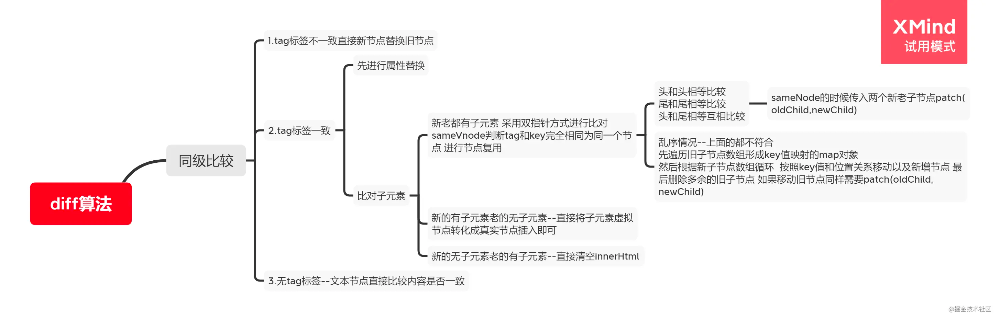

# Vue

## vue中data为什么要是一个函数
> 因为一个组件可能会在多个地方使用，使用data定义为函数每次调用就会执行data函数并返回一个新的对象，可以避免数据污染

## vue修饰符
1. .sync 目前用的最多的，子组件想修改父组件传过来的值时，通过$emit('update:propName', xxx) 父组件中 propName对应的属性会被修改为 xxx，相对于通过emit一个方法，父组件注册方法再修改值，这种方式要方便很多。
2. .once 只执行一次
3. .prevent 阻止默认事件，例如a标签的跳转
4. .lazy 将input的input事件延迟到blur执行
5. .trim 去掉输入框收尾的空格

## vue 内部指令
1. v-for
2. v-if
3. v-show
4. v-model
5. v-on
6. v-once 元素和组件只渲染一次
7. v-slot 缩写是# 插槽名
8. v-pre 跳过这个元素和他的子元素的编译过程，可以用来显示原始的 Mustache标签，跳过大量没有指令的节点会加快编译速度
9. v-cloak 保持在元素上直到关联实例结束编译。和css规则入 v-cloak{display:none} 一起用时，这个指令可以隐藏未编译的标签中的Mustache 直到实例准备完成

## 组件传值的方式
1. props 直接传递
2. 获取组件实例，调用方法传递，或者直接修改属性值
3. eventBus
4. vuex
5. provide、inject
6. 浏览器缓存 localstorage

## 路由模式有哪些模式 以及不同点
1. hash模式：浏览器的地址栏中会有#号，通过#号后面的内容更改，触发hashchange事件，实现路由跳转
2. history模式：通过pushState和replaceState切换url，实现路由切换，需要后端配合，之前用的是nginx

## 动态设置 class style
1. :class="['className', true && 'classB',]"
2. :class="(function() {return ''})()" // 还可以是一个函数 返回值是字符串 'cls1 cls2 cls3'
3. :style="{height: '20px', width: getWidth(), color: isRed ? 'red' : 'black'}"
4. :style="[{color: textColor, fontSize: '18px'}, {xx:xx}]"

## v-if 和 v-show的区别
1. v-if 会动态的删除节点或者插入节点，每一次显示隐藏都会重新跑一遍生命周期，显示隐藏决定了组件的生成和销毁
2. v-show 是通过css样式控制是否显示，不会销毁
3. 频繁或者大数量的显隐用 v-show  否则用v-if

## computed和watch的区别
1. computed有缓存，多个属性计算出一个值，如果多个属性没有发生变化，computed会使用缓存的值，否则重新计算。computed不支持异步
2. watch是监听一个值变化，修改其他的值。可以进行异步操作
3. computed 是多对一， watch是一对多
4. computed传参 可以返回一个函数
```javascript
this.a = {
    b: 1
}
<div>{{cptTest(a.b)}}</div>
computed: {
    cptTest () {
        return function(num) {
            return num + this.a.b
        }
    }
}
```
## v-if和 v-for 为什么不建议用在同一标签
1. 在 vue2中 v-for 优先级高于 v-if
2. 会先创建出来dom，然后判断 if条件是否成立，需不需要删除dom，导致渲染了不需要的dom
3. 使用computed解决

## vuex属性及用处
1. State：存储数据
2. Getter：允许组件从store中获取数据，mapGetters辅助函数仅仅是将store中的getter映射到局部计算属性
3. Actions：与mutation沟通的桥梁，用于提交mutation，而不是直接更改状态。可以在这里做异步操作
4. Mutations：唯一更改store中状态的方法，必须是同步函数
5. Module：管理 store，单一的store 可以拆分成多个store且同时保存在单一的状态树中

## 不需要定义响应式数据
1. 定义在data之外
```javascript
data() {
    this.a = 1
    return {}
}
```
2. 使用Object.freeze()冻结数据
```javascript
<div>
    {{a.value}}
</div>
data() {
    return {
        // a.value无法被更改，尝试更改会报错，vue也会警告Cannot assign to read only property 'value' of object 
        a: Object.freeze({value: 1})
    }
}
```
## watch有哪些属性，分别有什么作用
```javascript
watch: {
    propA: {
        handler(oV, nV) {// 执行回调},
        deep: true, // 是否进行深度监听
        immediate: true// 立即执行
    }
}
```
## 父子组件生命周期
父 beforeCreated -> 父created -> 父beforeMounted -> 子beforeCreated ->子created -> 子beforeMounted ->子mounted -> 父mounted
-> 父beforeUpdate -> 子beforeUpdate -> 子update -> 父update
-> 父beforeDestroy -> 子beforeDestry -> 子destroy -> 父 destroy

## 对象新增或删除属性无法更新视图的原因和解决方法
1. vue没法监听到对象新增属性和删除的动作，所以就没法对新的属性进行数据劫持，自然就无法 更新视图
2. $set(obj,key,v) $delete(obj, k)
3. 通过Vue.observable(obj) 将对象变为响应式对象，模板中要用这个方法返回的值，并且对于基本类型需要在值变化后强制刷新
```javascript
<div>
    {{reactiveObj.name}}
    {{reactiveNum}}
</div>
data() {
    this.obj = {name: '张三'}
    this.num = 1
    return {}
},
created() {
    this.reactiveObj = Vue.observable(this.obj)
    this.reactiveNum = Vue.observable(this.num)
    // 后面如果修改 reactiveObj.name = '李四' ui会刷新
    // 如果修改 reactiveNum 需要在值改变后调用 $fourceUpdate
    
}
```

## arr[index] = xx 无法更新视图
1. vue没法监视直接通过下标修改数组元素，没有对数组进行Object.defineProperty的属性劫持
2. 所以vue重写了 数组的7个方法来实现响应式，直接用下标的方式改为响应的方法就行
3. 七个方法分别是 push pop slice shift unshift reverse sort
4. 通过$set(arr, index, value)

## 自定义指令 [自己用的并不多，多看下](https://cn.vuejs.org/v2/guide/custom-directive.html)
1. bind：只会调用一次，指令第一次绑定到元素的时候调用。
2. inserted：被绑定元素插入父节点时调用，既然已经插入父节点了，父节点肯定存在，但是父节点有没有被渲染出来就不知道了。即 不确定html文档中有父节点
3. update：所在组件的VNode更新时调用，但是可能发生在其子VNode更新之前。指令的值可能发生变化，在这里决定是否处理指令的逻辑
4. componentUpdated：指令所在组件的VNode及其子VNode全部更新后调用。这里做指令的动作似乎更合理？ 需要思考下具体的应用场景
5. unbind：只会调用一次，指令与元素解绑时调用。
6. 一个指令定义对象可以提供上面几个钩子函数，都是可选的。以上钩子均会收到下面的参数
7. el：指令所在的元素，自定义标签属性传值应该是可行的。可以直接操作dom
8. binding：
   1. name：指令名，不包括 v- 前缀
   2. value：指令绑定的值 v-xxx="a" ,绑定值为a。注意：a可能是个表达式、函数或者是具体的值，用到的时候要判断下，或者约定好
   3. oldValue：顾名思义。这个属性仅在update 和componentUpdate中可用。无论值是否改变。所以可能对比新旧值是否变化，决定要不要做指令的操作
   4. arg：传给指令的参数，可选。 v-xxx:foo中  参数为 "foo"。这个用着不是很方便，具体的忘记了。。。
   5. modifiers：一个包含修饰符的对象。v-xxx:foo.bar中，修饰符对象为 {foo:true, bar:true} 没用过。。
9. vnodo oldVnode

## 插槽的使用及原理  [原理不是很熟悉,看这里](https://juejin.cn/post/6949848530781470733#heading-5)
有三种插槽
1. 默认插槽
```javascript
// child
<div>
    <p>child</p>
    <slot></slot>   
</div>
// parent
<div>
   <p>parent</p>
   <child>
      alskdjf 
   </child>
</div>
```
2. 具名插槽
```javascript
// child
<div>
    <p>child</p>
    <slot name="one"></slot>
    <slot name="two"></slot>
</div>
// parent
<div>
   <p>parent</p>
   <child>
      alskdjf 
      <span v-slot:"one">这是具名插槽</span>
      <div v-slot:"two">
         <p>slot two</p>
      </div>
   </child>
</div>
```
3. 作用域插槽。父组件想用子组件的数据渲染 UI
```javascript
// child
<div>
   <p>child</p>
   <slot :childData="childData"></slot>
    <slot name="two" :data2="childData"></slot>
</div>
// parent
<div>
   <p>parent</p>
   <child>
      <div v-slot:default='defaultSlot'>
         {{defaultSlot.childData}}
      </div>
      <div v-slot:two="slot2Data">
         {{slot2Data.data2}}
      </div>
   </child>
</div>
```
## 为什么不建议 index或随机数作为key
当列表数据顺序发生变化时，index所对应的值会变,会造成不必要的渲染，浪费性能
在数组前面插入一个值时，会重新渲染整个数组，因为index对应的值发生了变化
数组中每个对象的id 是唯一的，用id作为key就不会
```javascript
<ul>
   <li v-for="(item,index) in list" :key="index"></li>
</ul>
let list = [1,2,3,4]
list.unshift(0)
```
## nextTick的用处
Vue更新dom并不是某个值发生了变化就立马去更新的，采用的`异步更新`的策略
`同一事件循环内`多次修改，会`统一`进行一次`视图更新`，这样才能节省性能
nextTick中的回调函数就是在视图更新后，下一个事件循环执行

## nextTick 原理
传入的回调函数被收集到 callback中

用微任务并按照优先级优雅降级的方式实现异步刷新

promise > MutationObserver > setImmediate > setTimeout

## SSR 服务端渲染，这个没用过
服务端使用Vue渲染好HTML传给前端，前端只需要渲染HTML
首次加载更快，更好的用户体验，更好的seo优化

## Vue响应式原理

数据劫持 + 观察者模式
vue会通过Object.defineProperty()方法，对定义在data中的属性进行劫持，数组则是通过重写数组方法来实现。
当页面使用对应属性时，每个属性都有自己的dep属性，用于存放它所依赖的watcher
在对属性进行 get的时候通过Dep收集依赖(watcher)，set的时候通过watcher触发更新。
<br>
Observer类可以将正常的对象转换为响应式对象。data中定义的每个字段，都会创建一个对应的Observer的实例
在原对象的__ob__属性上。

## Vue [模板编译原理](https://juejin.cn/post/6969563640416436232)
大概的流程是这样：扫描 template 标签中的代码，解析成抽象语法树，然后将抽象语法树转换为 render渲染函数需要的格式

## [computed和watch的原理](https://juejin.cn/post/6974293549135167495)


## Vue.set方法原理
把set传入的对象变为 响应式对象，内部的defineReactive函数会执行

## Vue.delete原理
1. 是数组 直接调用splice方法
2. 判断对象本身有没有这个属性，没有就直接返回
3. 否则删除这个属性
4. 判断这个对象是不是响应式对象，不是就直接返回
5. 是的话就通知 视图更新 ob.dep.notify()

## Vue 检测数组变化
通过重写数组的7种方法(push,pop,splice,shift,unshift,sort,reverse)
所以修改数组的索引和长度是无法被检测的，只有通过以上7个方法才会触发数组对应的watcher更新。
<br>push splice unshift 会往数组中增加新的值，这个值也要变成响应式的

## 虚拟DOM是什么 有什么优点
虚拟dom是用JavaScript对象对真实dom的一层抽象，用原生的js对象取描述一个真实的dom。

优点：
1. 避免手动操作dom，只要写好View-Model的代码逻辑，框架会根据虚拟dom的双向绑定，自动更新视图。
2. 跨平台，例如weex、服务器渲染等

缺点： 首次渲染需要生成虚拟dom对象，没有直接修改innerHTML对象

## v-model原理
v-model只是语法糖而已，在内部为不同的输入元素使用不同的property并抛出不同的事件
1. input text 使用 value和input事件
2. checkbox 和radio使用 checked属性和change事件
3. select 将value作为prop 并将change作为事件。

## v-for 为什么要加key
让diff算法更准确、更快速
1. diff算法中通过对比新旧虚拟节点的key 避免就地复用的情况，所以更加准确
2. 利用key 的唯一性，生成map对象来获取对应节点，比遍历更快

## [diff算法的原理](https://juejin.cn/post/6844904113587634184#heading-0)
vue中模板语法最终会转换为AST，当模板中某个部分发生变化时，要尽可能最小的更新dom，
通过diff算法对比，新旧虚拟节点的变化，来达到目的。
<br>
判断两个节点是否相同是比较两个节点的 标签和key是否相等

1. 新前与旧前
2. 新后与旧后
> 1、2属于修改节点
3. 新后与旧前 
4. 新前与旧后
> 3、4 属于移动节点，例：列表的第二项，移动到列表的最后==

1. 新的第一个虚拟节点 与 旧的第一个虚拟节点比较，命中并处理后，新旧节点指针下移 继续比较下一个节点
2. 新的最后一个虚拟节点 与 旧的最后一个虚拟节点比较，命中并处理后，新旧节点指针往前移动，继续下一次比较
3. 新的最后一个虚拟节点 与 旧的第一个虚拟节点比较，命中并处理后，新的指针上移，旧的指针下移
4. 新的第一个虚拟节点 与 旧的最后一个虚拟节点比较，命中并处理后，新的指针下移，旧的指针上移
5. 都没有命中，可能是插入了新的节点、删除了旧的节点、（移动且删除了旧的节点）


## vue事件绑定原理
原生的事件绑定是调用addEventListener绑定给真实元素的。组件事件是通过Vue的 $on实现的，基于发布订阅模式，维护一个事件中心，on的时候将事件按名称存在事件中心里，称之为订阅者，
然后emit将对应的 事件发布，执行事件中心里对应的监听器。

## vue-router路由钩子函数的执行顺序
钩子函数有全局守卫、路由守卫、组件守卫三种
<br>完整的导航解析流程
1. 导航被触发
2. 在失活的组件中调用 beforeRouteLeave
3. 调用全局的beforeEach守卫
4. 在重用的组件中调用 beforeRouteUpdate守卫
5. 在路由配置中调用beforeEnter
6. 解析异步路由组件
7. 在被激活的组件中调用beforeRouteEnter
8. 调用全局的beforeResolve守卫
9. 导航被确认
10. 调用全局的afterEach钩子
11. 触发dom更新
12. 调用beforeRouteEnter守卫中给next的回调函数，创建好的组件实例会作为回调的参数 传入

## vue 异步路由
1. vue-router配置路由，可以实现按需加载，但是这种情况一个组件生成一个js文件。
```javascript
{
  path: '/promisedemo',
  name: 'PromiseDemo',
  componet: resolve(['../components/PromiseDemo'], resolve)
}
```
2. es提案的import()
```javascript
export default new Router({
    routes: [
        {
            path: '/promisedemo',
            name: 'PromiseDemo',
            // 魔法注释的形式指定多个文件打包为一个js文件
            componet: import(/* webpackChunkName: 'PromiseDemo' */'../components/PromiseDemo')
        },
        {
            path: '/promisedemo2',
            name: 'PromiseDemo2',
            componet: import(/* webpackChunkName: 'PromiseDemo' */'../components/PromiseDemo2')
        }
    ]
})
```
3. webpack提供的require.ensure()方法，也可以实现按需加载，多个路由指定相同的chunkName，会合并为一个js文件
```javascript
{
    path: '/promisedemo',
    name: 'PromiseDemo',
    // 魔法注释的形式指定多个文件打包为一个js文件
    componet: r => require.ensure([], () => r(require('../components/PromiseDemo')), 'promsiseDemo')
},
{
    path: '/promisedemo2',
    name: 'PromiseDemo2',
    componet: r => require.ensure([], () => r(require('../components/PromiseDemo2')), 'promsiseDemo')
}
```

## vue 动态路由的问题
### 组件复用导致路由参数丢失的解决办法
因为组件复用不会触发生命周期的部分钩子，可以通过一下方式解决
1. 监听route的变化
```javascript
watch: {
    "route": function () {
        console.log(this.$route)
    }
},
// 和上面的方式一样
created() {
    this.$watch(
        () => this.$route.params,
        (toParams, previouseParams) => {
            console.log(toParams)
        }
    )
}
```
2. 使用导航守卫 beforeRouteUpdate，它也可以取消导航
```javascript
const user = {
    template: '...',
    async beforeRouteUpdate(to, from) {
        this.userData = await fetchUser(to.params.id)
    }
}
```
3. :key 阻止复用
```javascript
<router-view :key="$route.fullPath"/>
```

## vuex
vuex是专门为vue提供的全局状态管理系统，用于多个组件之间共享数据、缓存等
主要包括：
<br>
1. State 定义应用状态的数据结构，设置默认的状态
2. Getter 用于从store中获取数据
3. Actions 用于提交数据到mutation，而不是直接更改数据，可以在这里做一些异步任务=
4. Mutations 唯一用于更新state中的状态，且必须是同步函数
5. Module 允许将单一的store拆分为多个store 且同时保存在单一的状态树中

## vuex刷新页面后数据会丢失
需要对vuex数据持久化，一般用本地存储的方式来保存数据，vuex-persist插件就是做这个的，可以直接将state的数据保存至 cookie或者localstorage中

## vue中使用了哪些设计模式
1. 工厂模式 虚拟DOM根据参数的不同返回基础标签的Vnode和组件vnode
2. 单例模式 vuex和vue-router的插件注册方法 install判断如果系统存在实例就直接返回
3. 发布-订阅模式 vue事件机制
4. 观察者模式 响应式原理
5. 装饰模式 @装饰器的用法 @click @xxx 自定义指令==
6. 策略模式 对象的有某个行为，但在不同的场景中，该行为有不同的实现方案 比如选项的合并策略 vue中的mixin合并mergeOptions方法

## vue性能优化
1. 对象层级不要过深，否则性能就会差
2. 不需要响应式的数据不要放到data中
3. v-if和v-show区分场景使用
4. computed和watch区分场景使用
5. v-for遍历必须加key，key保证唯一，避免使用数组下表作为index，同时避免和v-if一起使用
6. 大数据列表和表格性能优化- 虚拟列表/虚拟表格
7. 防止内部泄露，组件销毁后把全局变量和事件销毁
8. 图片懒加载
9. 路由懒加载
10. 第三方插件按需引入
11. 适当采用keep-alive缓存组件
12. 防抖、节流的运用
13. 服务端渲染、预渲染

## nextTick 使用场景和原理
修改数据之后需要获取到对应的最新dom，可以用这个方法
<br>
主要思路是采用微任务优先的方式调用异步方法取执行nextTick包装的方法
<br>
采用优雅降级的方式,
<br>
1. 先尝试使用promise
2. 如果没有，尝试使用 MutationObserver （这个主要是监听dom变化，也是一个异步方法）
3. 上面都没有，尝试使用 setImmediate
4. 还没有就用setTimeout

## keep-alive 场景和原理
vue内置的组件，可以实现组件缓存。用于多个tab切换时，不会对当前组件进行卸载
> 常用的两个属性 include/exclude 允许组件有条件的进行缓存<br>
> 两个生命周期activated/deactivated 用来得知当前组件是否处于活跃状态<br>
> keep-alive中还运用了LRU算法，选择最近最久未使用的组件予以淘汰<br>


## Vue.set 原理
给响应式对象新增不存在的属性时，首先会把新的属性进行响应式跟踪，然后触发对象__ob__的dep收集到的watcher取更新。
<br>当修改数组索引时，调用数组的splice方法取更新数组

## Vue.extend 原理
Vue.extend使用基础的Vue构造器，创建了一个"子类"。参数是一个包含组件选项的对象
<br>使用原型的继承方法返回了Vue的子类，并且利用mergeOptions把传入的options和父类的options进行了合并。
```javascript
export default function initExtend(Vue) {
    let cid = 0
    Vue.extend = function (extendOptions) {
        const Sub = function VueComponent(options) {
            this._init(options) // 调用Vue初始方法
        }
        Sub.cid = cid++
        // 子类原型指向父类
        Sub.prototype = Object.create(this.prototype)
        Sub.prototype.constructor = Sub
        Sub.options = mergeOptions(this.options, extendOptions)
        return Sub
    }
}
```

## Vue 自定义指令
指令本质上是装饰器，是Vue对HTML元素的扩展，给HTML元素增加自定义功能。vue编译dom时，会找到指令对象，执行指令相关方法。
<br>有五个生命周期钩子 
1. bind：只调用一次，指令第一一次绑定到元素时调用。在这里可以做一些初始化设置。
2. inserted：被绑定元素插入到父节点时调用（仅保证父节点存在，但不一定被插入到文档中）
3. update：被绑定于元素所在的模板更新时调用，而无论绑定值是否变化。通过比较更新前后的值，可以忽略不必要的模板更新。
4. componentUpdated：被绑定元素所在模板完成一次更新周期时调用。
5. unbind：只调用一次，指令与元素解绑时调用

原理：
1. 生成AST时，遇到指令会给当前元素添加 directives属性
2. 生成指令代码
3. 在patch前将指令的钩子提取到cbs中，在patch过程中调用对应的钩子
4. 当执行指令对应的钩子函数时，调用对应指令定义的方法

## Vue生命周期钩子的实现原理
利用发布订阅模式，把用户传入的回调函数记录在数组中，之后在创建实例对象的过程中依次执行回调，
vue也是在这里保证了在vue对象实例中的this指向vm实例

## vue-router中常用的路由模式实现原理
### hash模式 兼容性好，但是不美观
1. 就是url中#号后面的部分，特点是 hash虽然出现在url中，但是不会包含在http请求中，对后端没影响，因此改变hash不会重新加载页面
2. 可以为hash的改变添加监听事件：
```javascript
window.addEventListener('hashchange', func, false)
```
### history模式，好看点，但是刷新会出现404 需要服务端配合，一般使用Nginx将404转发到index.html，然后根据路由显示对应的页面
1. 利用了h5 History Interface 中新增的pushState和replaceState方法
2. 这两个方法的共同点：当调用他们修改浏览器历史记录栈后，虽然当前URL改变了，但是浏览器不会刷新
