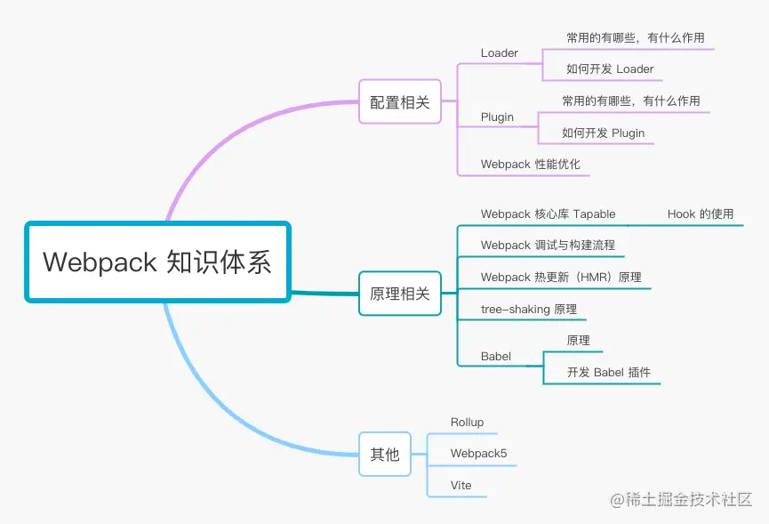

# webpack相关内容
[详细版本](https://juejin.cn/post/6844904094281236487)


## loader的作用
webpack只认识json和js文件，其他类型都处理不了，loader的作用就是将webpack不认识的内容转化为认识的内容。
1. css-loader：解析css样式资源
2. style-loader：创建style标签并放在html的head中
3. postcss-loader：自动添加css3部分属性的浏览器前缀
4. less-loader：处理less样式资源
5. sass-loader：处理saas样式资源
6. file-loader: 解决图片引入问题，并将图片copy到指定目录，默认为dist
7. url-loader: 解依赖file-loader，当图片小于limit时，会将图片转为base64，大于limit依然使用file-loader拷贝
8. img-loader：压缩图片
9. babel-loader：使用babel加载ES2015+ 代码兵将其转换为ES5
10. thread-loader：多进程配置。实际上在小型项目中，开启多进程打包反而会增加时间成本，因为启动进程和进程间通信都会有一定开销


## 插件
与Loader用于转换特定类型的文件不同，插件可以贯穿webpack打包的生命周期，执行不同的任务。

1. html-webpack-plugin：将打包后的js、css自动引入到指定的html文件中
2. clean-webpack-plugin：自动清空打包目录
3. mini-css-extract-plugin：分离样式文件，将css以文件形式引入页面
4. optimize-css-assets-webpack-plugin: 压缩css
5. terser-webpack-plugin：压缩js
6. purgecss-webpack-plugin：会单独提取css并清除用不到的css

## source-map
校验规则`^(inline-|hidden-|eval-)?(nosources-)?(cheap-(module-)?)?source-map$`
1. inline：代码通过dataUrl形式引入sourceMap
2. hidden：生成sourceMap文件，但不使用
3. eval：`eval(...)`形式执行代码，通过dataUrl形式引入
4. nosources：不生成sourceMap
5. cheap：只需要定位到行信息，不需要列信息
6. module：展示源代码中的错误位置

开发环境推荐配置：`eval-cheap-module-source-map`
1. 首次打包慢点，有`eval`缓存，rebuild会很快
2. 只要能定位到行就行，所以加上cheap
3. 希望找到源代码的错误，而不是打包后的，所以加上 `module`

生产环境建议配置：`none`，别人就无法看到源代码

## hash
打包后文件名字中的hash值，基础配置中用到的：`filename:"[name][hash:8][ext]"

1. hash：任何一个文件的改动，整个项目的构建hash值都会变
2. chunkhash：文件的改动只会影响其所在chunk的hash值，不同的entry会生出不同的chunkhash
3. contenthash：每个文件都有单独的hash值，文件的改动只会影响自身的hash值


## babel

## 优化配置
1. alias
   1. alias用于创建 import 或 require的别名，来简化模块引用
   2. 可以避免在多个不同层级的文件中，引入同一模块，需要修改文件路径
2. extensions
   1. webpack默认配置，resolve:{extensions: ['.js','.json','wasm']}
   2. 允许引入模块时不带扩展名
   3. 注意：高频文件后缀名放前面。有个两个相同的文件 index.js 和 index.json 会优先选择index.js
3. modules
   1. 告诉webpack解析模块时应该搜索的目录
   2. resolve:{modules: [resolve('src'),'node_modules']}
4. external
   1. `external`配置选项提供了「从输出的bundle中排出依赖」的方法。
   2. 例如从cdn中引入某些第三方库，那么这些文件就不用打包到bundle中
   3. 剥离一些不需要改动的依赖，节省打包时间。
5. 配置loader时，排出某些不需要解析的目录
   1. include：符合条件的模块进行解析
   2. exclude：排出符合条件的模块，不解析。优先级高于include
   3. 例如在babel-loader中只解析src中的js文件，排出node_modules中的依赖
6. babel-loader开启缓存
   1. babel在转译js过程中开销较大，将babel-loader的执行结果缓存起来可以大大缩短编译速度
   2. cache-loader：缓存一些开销较大的loader的处理结果，缓存位置：node_modules/.cache/cache-loader
```javascript 
      rules:[
        {
            test: /\.(s[ac]|c)ss$/i, //匹配所有sass/scss/css文件
            use: [
                MiniCssExtractPlugin.loader,
                'cache-loader',// 获取前面loader转换的结果
                'css-loader',
                'postcss-loader',
                'sass-loader'
            ]
        }
      ]
```
7. Tree-shaking：剔除无用代码，以降低包的体积    
8. Scope Hoisting：作用于提升，原理是将多个模块放在同一个作用域下，并重命名防止命名冲突，通过这种方式可以减少函数声明和内存开销
9. 提升首屏的加载速度：降低首屏加载文件的体积，首屏不需要的文件进行预加载或者按需加载
10. prefetch和preload：
    1. prefetch：预获取，浏览器空闲的时候进行资源拉取
    2. preload：预加载，提前加载后面会用到的关键资源，因为会提前加载，如果不是特殊需要，慎用


*****************************************

## webpack的构建流程是什么
1. `初始化参数`：解析webpack配置参数，合并shell传入和webpack.config.js文件配置的参数，形成最后的配置结果。
2. `开始编译`：上一步得到的参数初始化compiler对象，注册所有配置的插件，插件监听webpack构建生命周期的事件节点，做出相应的反应，执行对象的run方法开始执行编译。
3. `确定入口`：从配置的entry入口，开始解析文件构建AST语法树，找出依赖，递归下去
4. `编译模块`：递归中根据文件类型和loader配置，调用所有配置的loader对文件进行转换，再找出该模块依赖的模块，再递归本步骤直到所有入口依赖的文件都经过处理
5. `完成模块编译并输出`：递归完事后，得到每个文件结果，包含每个模块以及他们之间的依赖关系，根据entry或分包配置生成代码块chunk
6. `输出完成`：输出所有的chunk到文件系统。

## webpack热更新的原理
当文件变化触发webpack进行编译并完成后，通过socket消息告诉浏览器准备刷新。为了减少刷新代价，只刷新变化文件打包后的模块，
webpack-dev-server可以支持热更新，通过生成文件的hash值来对比需要更新的模块，浏览器再进行热替换

## webpack插件如何实现
1. webpack本质是一个事件流机制，核心模块：tapable(Sync + Async)Hooks 构造输出 === compiler(编译) + compilation(创建bundles)
2. compiler对象代表了完整的webpack环境配置。这个对象在启动webpack时被一次性建立，并配置好所有可操作的配置，包括options、loader和plugin。当在webpack环境中应用一个插件时，插件将收到此compiler对象的引用。可以用它来访问webpack的主环境。
3. compilation对象代表了一次资源版本构建。当运行webpack开发环境中间件时，每当检测到一个文件变化，就会创建一个新的compilation，从而生成一个新的编译资源。一个compilation对象表现了当前的资源模块、编译生成资源、变化的文件、以及被跟踪依赖的状态信息。
4. compilation对象也提供了很多关键时机的回调，以供插件做自定义时选择使用
5. 创建一个插件函数，在其prototype上定义apply方法，制定一个webpack自身的事件钩子
6. 函数内部处理webpack内部实例的特定数据
7. 处理完成后，调用webpack提供的回调函数

## 如何使用webpack优化前端性能
用webpack优化前端性能是指优化webpack的输出结果，让打包的最终结果在浏览器运行速度高效。
1. 压缩代码：删除多余的代码、注释、简化代码的写法等方式。
2. 利用CDN加速：在构建过程中，将引用的静态资源路径修改为CDN上对应的路径。可以利用webpack对于output参数和各loader的publicPath参数来修改资源路径
3. Tree-Shaking：将代码中永远不会走到的片段删掉。可以通过在启动webpack时追加参数 --optimize-minimize实现。
4. Code Splitting：将代码按路由维度或者组件分块(chunk)，这样做到按需加载，同时可以充分利用浏览器缓存
5. 提取公共第三方库：SplitChunksPlugin插件来进行公共模块抽取，利用浏览器缓存可以长期缓存这些无需频繁变动的公共代码